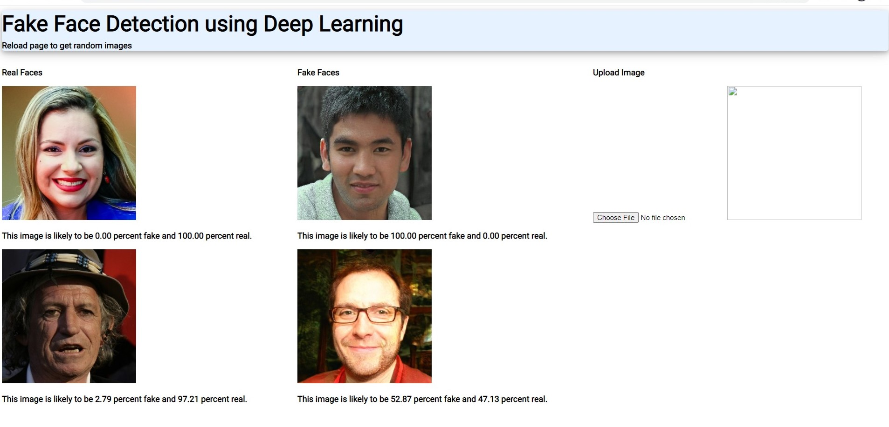

This is a flask app that lets you run inferences on a neural network trained with Keras on this 
[database](https://www.kaggle.com/haider97/fakefacedetection/data).

The neural network from [this](https://keras.io/examples/vision/image_classification_from_scratch/) tutorial was trained [here](https://www.kaggle.com/haider97/fakefacedetection).

